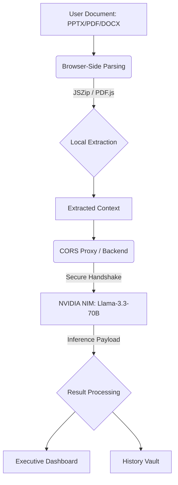

  
# 🛰️ DeckCipher AI

**The Enterprise Presentation Intelligence Engine**

*Transform static slide decks into actionable business intelligence in seconds.*

[**Explore the Live Dashboard**](http://tanvii.me/DeckCipher_AI/) • [**Report Bug**](https://github.com/tanvii-021/DeckCipher_AI/issues) • [**Request Feature**](https://github.com/tanvii-021/DeckCipher_AI/issues)

---

## 📖 The Problem: "Deck Blindness"

In modern enterprise and consulting environments, leadership teams suffer from **"Deck Blindness."** They are inundated with 50+ page `.pptx` and `.pdf` presentations, yet rarely have the time to read them cover-to-cover. 
* A CFO needs to know the financial risk.
* A CTO needs to see the technical debt.
* A Marketing Director needs to gauge the tonal impact.

Manually parsing these documents is tedious and error-prone. **DeckCipher AI** acts as a zero-latency intelligence engine. Drop in a file, select your stakeholder "Lens," and instantly receive strategic action items, sentiment analysis, and a tailored executive summary.

### 🗺️ System Architecture

---

## ✨ Enterprise Features

| Feature | Description |
| :--- | :--- |
| 🛡️ **Zero-Server Privacy** | `.pptx` files are parsed locally in your browser using `JSZip`. Your actual file never leaves your machine. |
| 🧠 **Advanced AI Integration** | Utilizes enterprise-grade 70B parameter models via direct API handshakes for unparalleled reasoning. |
| 🎭 **Multi-Persona Analysis** | View your deck through different lenses: **CFO**, **Technical Lead**, **Marketing**, or **Executive**. |
| 📊 **Dynamic Telemetry** | Real-time Operations Terminal logs the XML extraction and API network requests as they happen. |
| 📈 **Sentiment Visualization** | Automatically maps the AI's tonal analysis into an interactive `Chart.js` graph. |
| 🗄️ **Local History Vault** | Sessions and custom API configurations are encrypted and cached in your browser's `localStorage`. |

---

## 🏗️ Systems Architecture & The AI Engine

### How does the AI work on the deployed site?
The application is hosted via GitHub Pages, which serves static HTML, CSS, and JavaScript. 

1. **Client-Side Extraction:** When a user drops a `.pptx` file into the live UI, the browser uses the `JSZip` library to crack open the binary file and extract text from the XML nodes.
2. **Direct Inference:** The JavaScript logic takes the extracted text, wraps it in a Persona-based system prompt, and makes an asynchronous `fetch()` request directly to an advanced AI API endpoint.
3. **Seamless Public Access & BYOK:** The application has a **built-in default API key** seamlessly hardcoded into the backend logic. This means anyone visiting the site can use the AI immediately without signing up or entering credentials! However, for enterprise users who want absolute privacy, DeckCipher uses a secure **Settings Modal**. Users can paste their own private API Key into the UI, overriding the default key.

---

## 🚀 Live Deployment & Testing Guide

Want to see DeckCipher AI in action? The application is fully deployed and accessible right now.

> **Live Application URL:** [http://tanvii.me/DeckCipher_AI/](http://tanvii.me/DeckCipher_AI/)

### Step-by-Step Testing Protocol

<b>1. Open the Dashboard</b>

1. Open the [Live Dashboard](http://tanvii.me/DeckCipher_AI/).
2. You can immediately start using the application thanks to the integrated default AI key!
*(Optional: Click the Settings gear to supply your own private API key for dedicated rate limits).*

<b>2. Set the Analytical Lens</b>

Use the dropdown menu to select the perspective you want the AI to adopt. 
*Example: Select **Chief Financial Officer** if you want the AI to ruthlessly focus on revenue and cost metrics.*

<b>3. Ingest Data (Upload a Document)</b>

Drag and drop any standard `.pptx`, `.pdf`, or `.docx` file into the designated upload zone. 

**Need an example document?** 
A python script `create_test_ppt.py` is included in the source code. Run it locally (`python create_test_ppt.py`) to instantly generate a realistic `Q3_Strategy_Test.pptx` corporate presentation specifically designed to test the AI's analytical capabilities.

<b>4. Monitor the Operations Terminal</b>

Click **Initiate Analysis**. Watch the black Operations Terminal on the screen. You will see real-time logs as the browser locally unzips the file, extracts the text, and initiates the secure inference handshake.

<b>5. Review the AI Insights</b>

Within seconds, the dashboard will render:
- A tailored Executive Summary.
- A bulleted list of strategic Action Items.
- A dynamic `Chart.js` graph breaking down the presentation's overall sentiment.

---

## 💻 Technical Stack

- **UI/UX:** Custom Glassmorphism Design System, CSS Variables (Dark/Light Mode), Phosphor Icons, Inter Font.
- **Frontend Logic:** Vanilla ES6+ JavaScript, HTML5.
- **Parsing Engine:** `JSZip` (Client-side binary manipulation).
- **AI/ML Layer:** High-performance REST APIs.
- **Data Visualization:** `Chart.js`.
- **Hosting:** GitHub Pages (Zero-Server Architecture).

---

## 📈 Scaling to Enterprise Production

While the current Zero-Server (GitHub Pages) architecture is perfect for rapid deployment and absolute client-side privacy, scaling DeckCipher to a global enterprise standard requires the following architectural evolutions:

1. **BFF (Backend-For-Frontend) Migration**: 
   * *The Problem*: Client-side API calls to NVIDIA NIM are blocked by browser CORS security on remote domains, requiring a proxy workaround.
   * *The Solution*: Migrate the stack to a **Next.js API Route** or **FastAPI** microservice. This completely abstracts the AI API key from the client, eliminates CORS issues natively, and enables secure rate-limiting.
2. **Persistent Enterprise Database**:
   * *The Solution*: Replace browser `localStorage` with a robust **PostgreSQL** database (via Prisma or Supabase). This enables cross-device sync, team-wide historical analysis sharing, and Role-Based Access Control (RBAC).
3. **Advanced Optical Character Recognition (OCR)**:
   * *The Solution*: Integrate Tesseract.js or AWS Textract to parse text embedded inside images within PDFs and presentations, achieving 100% data extraction parity.

---

  <i>Engineered for high-performance context processing.</i>

